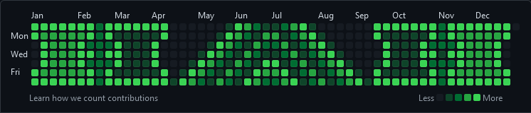
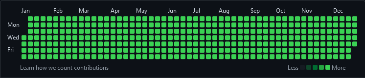
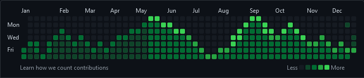

# GeoGraph

A ``bash`` script to create custom **GitHub Contribution Graph** using this [web](https://www.laurencegellert.com/software/github-graph-builder/).

## [2017 - Mosaic](https://github.com/RaulSanchezzt?tab=overview&from=2017-12-01&to=2017-12-31)

## [2020 - Blackout](https://github.com/RaulSanchezzt?tab=overview&from=2020-12-01&to=2020-12-31)

## [2021 - Bitcoin Chart](https://github.com/RaulSanchezzt?tab=overview&from=2021-12-01&to=2021-12-31)

## Skyline

- [2017](https://skyline.github.com/raulsanchezzt/2017)
- [2020](https://skyline.github.com/raulsanchezzt/2020)
- [2021](https://skyline.github.com/raulsanchezzt/2021)

## Inspiration

- [Gitfiti](https://github.com/gelstudios/gitfiti)
- [GitHub Contribution Chart Generator](https://github.com/sallar/github-contributions-chart)
- [Vincent van Git](https://github.com/jh3y/vincent-van-git)
- [GitHub Activity Generator](https://github.com/Shpota/github-activity-generator)